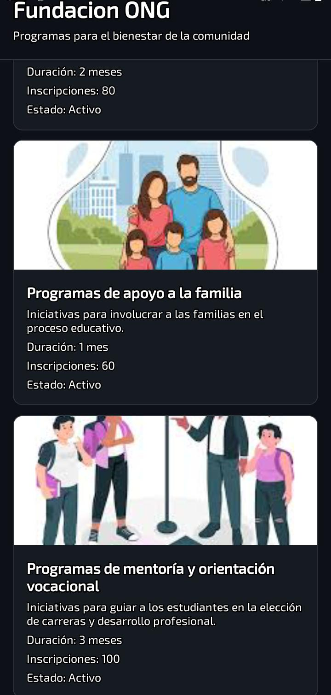

# 🤝 Fundación ONG — Primera Pantalla con Tarjetas

Aplicación móvil desarrollada con **React Native** y **Expo** que muestra una pantalla única con tarjetas de proyectos sociales de una fundación ONG. Cada tarjeta presenta información visual del proyecto con interacción táctil.

---

## 📱 Capturas de Pantalla

| Lista de Proyectos | Detalle de Tarjeta |
|:-:|:-:|
| |  |

---

## 🗂️ Dominio

La aplicación visualiza **proyectos sociales** de una fundación ONG. Cada tarjeta contiene:

- **Imagen** representativa del proyecto
- **Nombre** del proyecto
- **Descripción corta** de su impacto social
- **Botón** con feedback visual al presionar

---

## 📚 Temas Implementados

- **Core Components** — `View`, `Text`, `Image`, `ScrollView`, `Pressable`
- **Flexbox** — estructura y organización del layout
- **StyleSheet** — manejo de estilos sin inline styles
- **TypeScript** — interfaz para tipar los datos de cada proyecto
- **Pressable** — feedback visual al interactuar con las tarjetas

---

## 🛠️ Tecnologías

- [React Native](https://reactnative.dev/) `0.79.2`
- [Expo](https://expo.dev/) `~53.0.0`
- [TypeScript](https://www.typescriptlang.org/) `~5.8.3`


---

## 🚀 Cómo ejecutar

```bash
cd starter
pnpm install
pnpm start
```

Escanea el QR con **Expo Go** (SDK 53) desde tu dispositivo Android o iOS.

