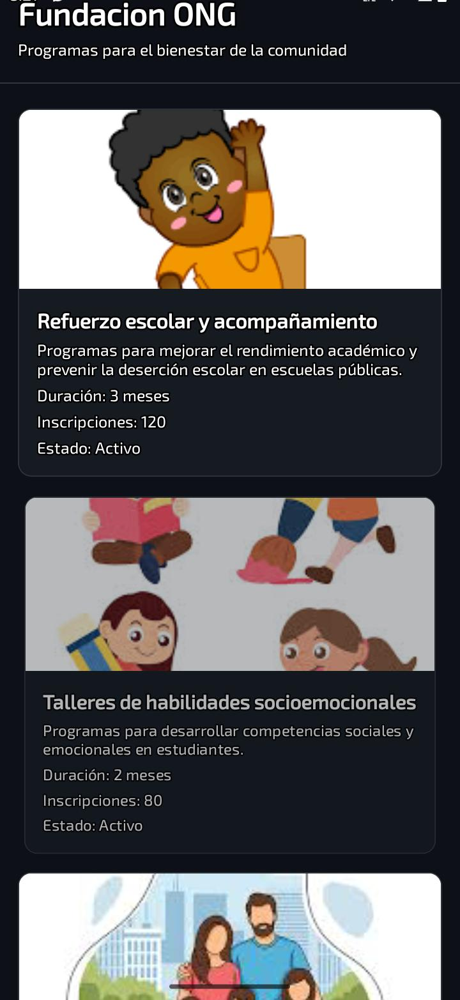

# Proyecto Semana 01 — App de Tarjetas

**Autor:** Liz Nayibe Rico Torres

---

Esta semana arranqué con mi primera pantalla en React Native. La idea era construir una app de pantalla única que mostrara una lista de 4 tarjetas, todo adaptado al dominio de una fundación ONG.

La pantalla muestra una serie de tarjetas con programas de la fundación. Cada tarjeta tiene una imagen, el nombre del programa ,una descripción corta, la duraciòn del programa, el número de inscrpciones y el estado del programa.

Para el layout usé **Flexbox**, que es como React Native organiza los elementos en pantalla. También exploré los **Core Components** principales como `View`, `Text`, `Image`, `ScrollView` y `Pressable`. Todos los estilos los manejé con `StyleSheet.create`, sin escribir estilos inline.

Además, como el proyecto está en **TypeScript**, definí una interfaz para tipar los datos de cada proyecto de la fundación.

---

## Temas que cubrí esta semana

- Core Components de React Native
- Flexbox para estructurar el layout
- StyleSheet para manejar estilos
- Interfaces con TypeScript
- Uso de `Pressable` con feedback visual

---

## Screenshots




---

## Cómo ejecutar el proyecto

```bash
cd starter
pnpm install
pnpm start
```