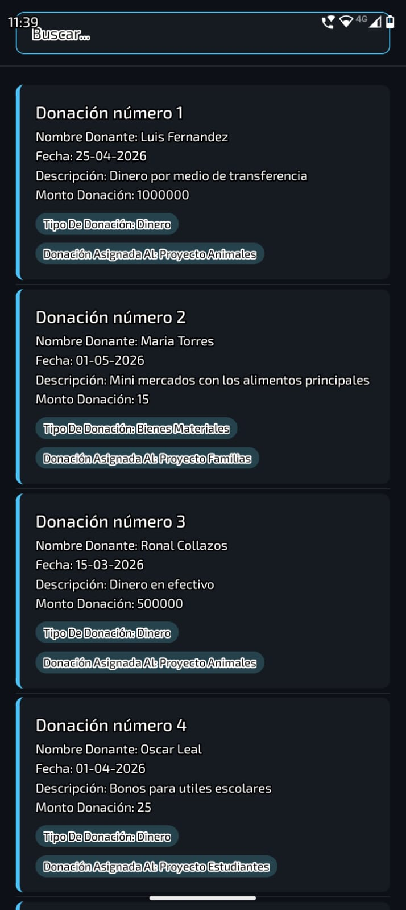
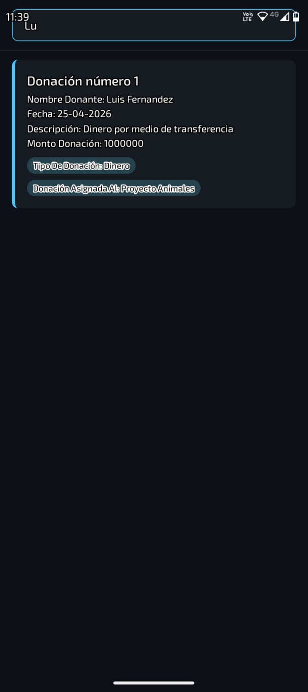
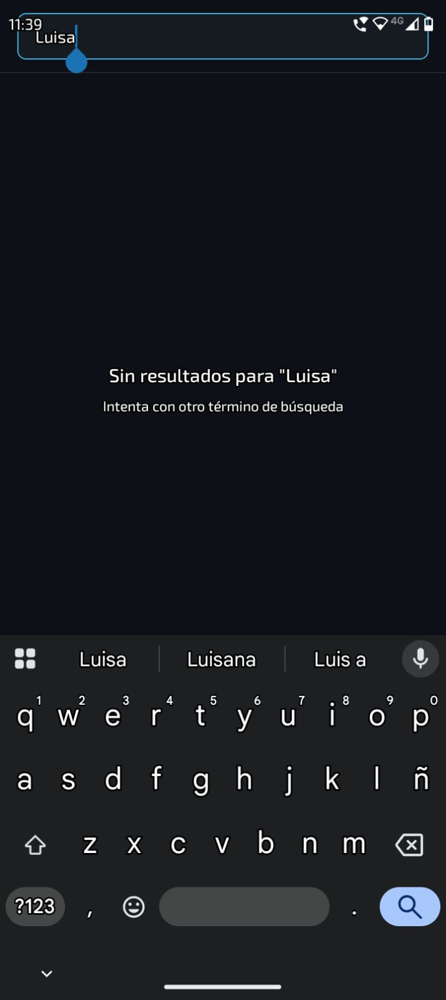

# 🤝 Fundación ONG — FlatList, Búsqueda y Hooks

Aplicación móvil desarrollada con **React Native** y **Expo** para gestionar y visualizar donaciones de una fundación ONG. Incluye búsqueda en tiempo real y visualización detallada de cada donación con badges informativos.

---

## 📱 Capturas de Pantalla

| Lista de Donaciones | Búsqueda Activa | Búsqueda sin Resultados |
|:-:|:-:|:-:
|  |  |  |

---

## 🗂️ Dominio

La aplicación gestiona **donaciones** de una fundación ONG. Cada donación contiene:

- **Nombre** del donante
- **Fecha** de la donación
- **Descripción** del aporte
- **Monto** donado
- **Tipo de donación** — Dinero, Bienes Materiales, etc.
- **Proyecto asignado** al que fue dirigida la donación

---

## 📱 Pantallas

### Lista de Donaciones
Muestra todas las donaciones en una `FlatList` de alto rendimiento. Cada tarjeta incluye la información del donante y dos badges al final: uno para el tipo de donación y otro para el proyecto asignado. Un borde azul a la izquierda separa visualmente cada tarjeta sin recargar la pantalla.

### Búsqueda en tiempo real
Buscador en la parte superior que filtra las donaciones por nombre del donante a medida que el usuario escribe. Si no hay resultados muestra un mensaje indicándolo.

---

## 🧠 Decisiones de Diseño

- **Tema oscuro** — coherente con los colores del dominio y definido desde el proyecto base
- **Badges** — destacan el tipo de donación y el proyecto asignado por ser los datos más relevantes a simple vista
- **Borde lateral** — separa visualmente cada donación sin recargar la interfaz
- **`useMemo`** — el filtrado de búsqueda es eficiente y no recalcula en cada render innecesario

---

## 📚 Temas Implementados

- **FlatList** — lista de alto rendimiento con separadores y estado vacío
- **Búsqueda en tiempo real** — filtrado por nombre del donante
- **`useMemo`** — optimización del filtrado
- **`useState`** — manejo del texto de búsqueda
- **Badges** — componentes visuales para tipo y proyecto
- **TypeScript** — interfaz para tipar los datos de cada donación

---

## 🛠️ Tecnologías

- [React Native](https://reactnative.dev/) `0.79.2`
- [Expo](https://expo.dev/) `~53.0.0`
- [TypeScript](https://www.typescriptlang.org/) `~5.8.3`


---

## 🚀 Cómo ejecutar

```bash
cd starter
pnpm install
pnpm start
```

Escanea el QR con **Expo Go** (SDK 53) desde tu dispositivo Android o iOS.

