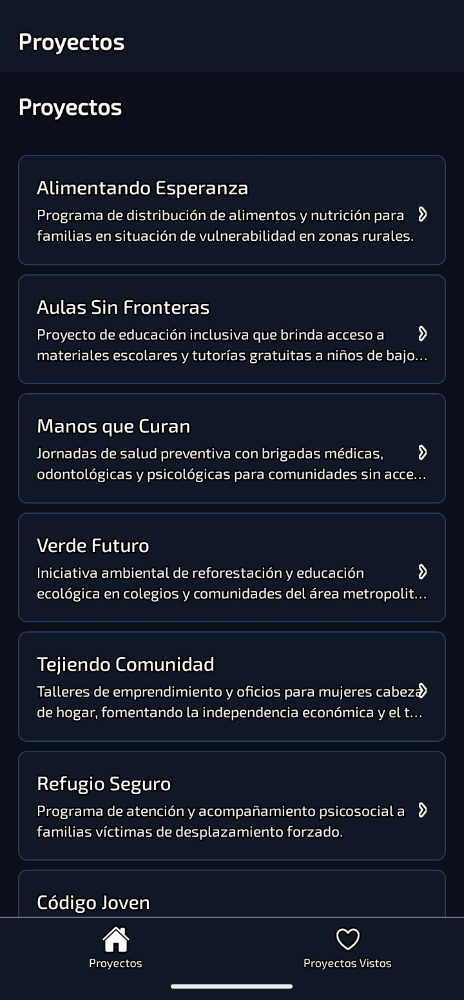
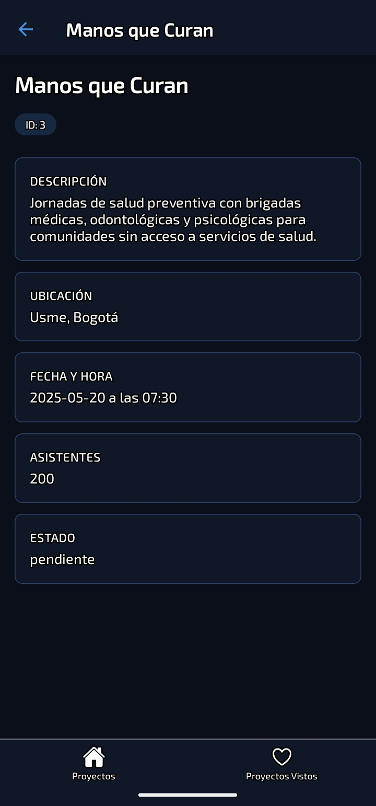
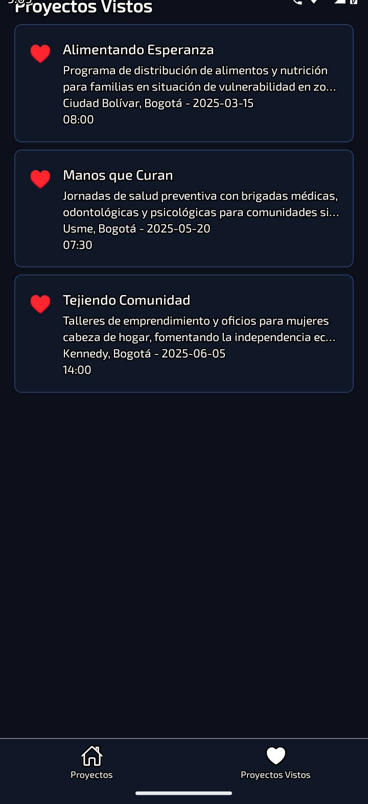

# 🤝 Fundación ONG — Gestión de Proyectos Sociales

Aplicación móvil desarrollada con **React Native** y **Expo** para la gestión y visualización de proyectos sociales de una fundación ONG. Permite explorar los proyectos activos, pendientes, completados e inactivos de la organización, así como ver el detalle de cada uno.

---

## 📱 Capturas de Pantalla

| Lista de Proyectos | Detalle del Proyecto | Proyectos Vistos |
|:-:|:-:|:-:|
| | |  |

---

## 🗂️ Dominio

La aplicación gestiona **proyectos sociales** de una fundación ONG en Bogotá. Cada proyecto contiene:

- **Nombre** del proyecto
- **Descripción** de su impacto social
- **Ubicación** por localidad en Bogotá
- **Fecha y hora** de ejecución
- **Número de asistentes** beneficiados
- **Estado**: `active` | `pending` | `inactive` | `completed`

---

## 🧭 Navegación Implementada

Este proyecto implementa navegación completa con **React Navigation 7**:

### Tab Navigator (raíz)
- **Proyectos** — pestaña principal con Stack Navigator anidado
- **Proyectos Vistos** — pestaña secundaria con lista de favoritos

### Stack Navigator (anidado en pestaña principal)
- **HomeList** — lista de todos los proyectos de la ONG
- **HomeDetail** — detalle de un proyecto seleccionado, con params tipados

### Tipado de parámetros
- `RootTabParamList` — tipos para el Tab Navigator
- `HomeStackParamList` — tipos para el Stack Navigator con params del detalle

---

## 🛠️ Tecnologías

- [React Native](https://reactnative.dev/) `0.79.2`
- [Expo](https://expo.dev/) `~53.0.0`
- [React Navigation 7](https://reactnavigation.org/)
  - `@react-navigation/native`
  - `@react-navigation/native-stack`
  - `@react-navigation/bottom-tabs`
- [TypeScript](https://www.typescriptlang.org/) `~5.8.3`
- [@expo/vector-icons](https://icons.expo.fyi/) — iconos Ionicons

---

## 📁 Estructura del Proyecto

```
src/
├── data/
│   └── mockData.ts          # 10 proyectos ONG + favoritos
├── navigation/
│   ├── RootNavigator.tsx    # Tab + Stack Navigator
│   └── types.ts             # Tipado de parámetros
├── screens/
│   ├── HomeScreen.tsx       # Lista de proyectos
│   ├── DetailScreen.tsx     # Detalle del proyecto
│   └── FavoritesScreen.tsx  # Proyectos vistos
├── theme/
│   └── index.ts             # Colores, tipografía, espaciado
└── types/
    └── index.ts             # Interfaz Projects
```

---

## 🚀 Cómo ejecutar

```bash
# Instalar dependencias
pnpm install

# Iniciar el servidor de desarrollo
pnpm start
```

Escanea el QR con **Expo Go** (SDK 53) desde tu dispositivo Android o iOS.

