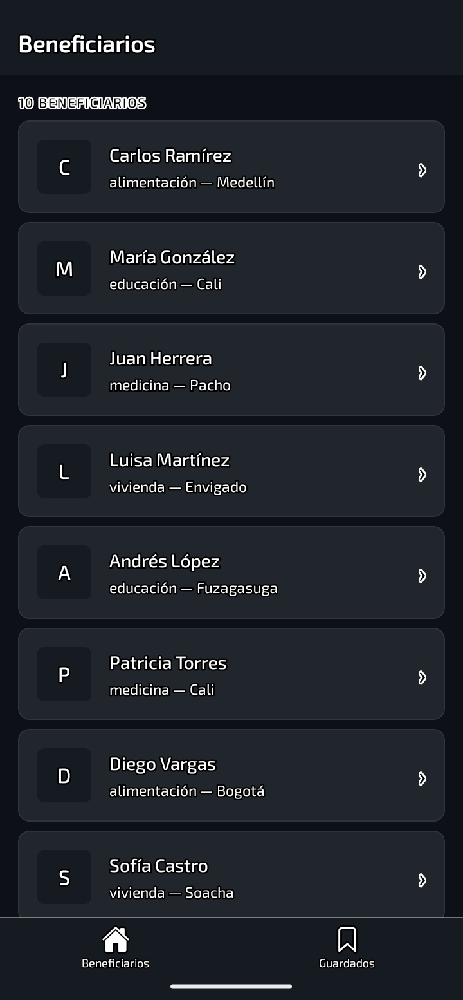
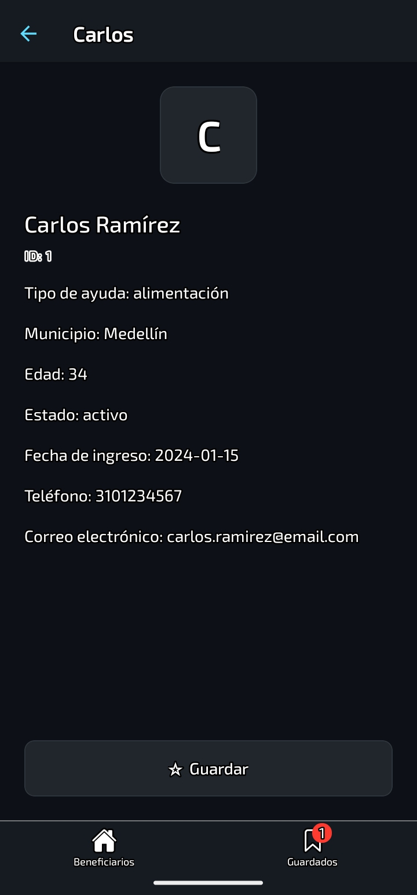
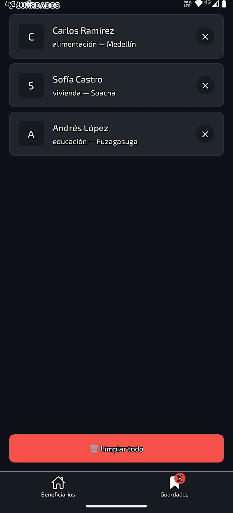
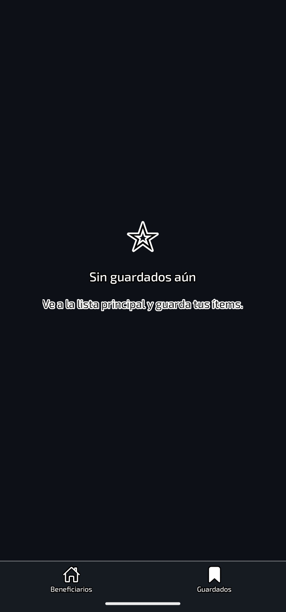

# 🤝 Fundación ONG — Gestión de Beneficiarios

Aplicación móvil desarrollada con **React Native**, **Expo** y **Zustand** para la gestión y visualización de beneficiarios de una fundación ONG. Permite explorar el listado de beneficiarios, ver el detalle de cada uno y guardarlos en una lista de seguimiento persistente entre pestañas.

---

## 📱 Capturas de Pantalla

| Lista de Beneficiarios | Detalle del Beneficiario | Guardados | Guardados Vacíos |
|---|---|---|---|
|  |  |  |  |

---

## 🗂️ Dominio

La aplicación gestiona beneficiarios de una fundación ONG en Bogotá. Cada beneficiario contiene:

- Nombre y apellido
- ID único
- Tipo de ayuda recibida
- Municipio de residencia
- Edad
- Estado de la ayuda
- Fecha de ingreso
- Telefono
- Correo


---

## 🧭 Navegación Implementada

Este proyecto implementa navegación completa con **React Navigation 7**:

**Tab Navigator (raíz)**
- `Home` — pestaña principal con Stack Navigator anidado
- `Guardados` — pestaña secundaria con lista de beneficiarios guardados

**Stack Navigator (anidado en pestaña Home)**
- `HomeList` — lista de todos los beneficiarios de la ONG
- `HomeDetail` — detalle del beneficiario seleccionado con params tipados

**Tipado de parámetros**
- `RootTabParamList` — tipos para el Tab Navigator
- `HomeStackParamList` — tipos para el Stack Navigator con params del detalle

---

## 🛠️ Tecnologías

- **React Native** 0.79.2
- **Expo** ~53.0.0
- **Zustand** — estado global sin prop drilling
- **React Navigation 7**
  - `@react-navigation/native`
  - `@react-navigation/native-stack`
  - `@react-navigation/bottom-tabs`
- **TypeScript** ~5.8.3
- **@expo/vector-icons** — iconos Ionicons

---

## 📁 Estructura del Proyecto

```
src/
├── data/
│   └── mockData.ts           # Beneficiarios de la ONG
├── navigation/
│   ├── RootNavigator.tsx     # Tab + Stack Navigator
│   └── types.ts              # Tipado de parámetros
├── screens/
│   ├── HomeScreen.tsx        # Lista de beneficiarios
│   ├── DetailScreen.tsx      # Detalle + botón Guardar/Quitar
│   └── SavedScreen.tsx       # Beneficiarios guardados
├── stores/
│   └── savedStore.ts         # Store Zustand de guardados
├── theme/
│   └── index.ts              # Colores, tipografía, espaciado
└── types/
    └── index.ts              # Interfaz Beneficiary
```

---

## 🚀 Cómo ejecutar

```bash
# Entrar a la carpeta del proyecto
cd starter

# Instalar dependencias
pnpm install

# Iniciar el servidor de desarrollo
pnpm start
```

Escanea el QR con **Expo Go (SDK 53)** desde tu dispositivo Android o iOS.